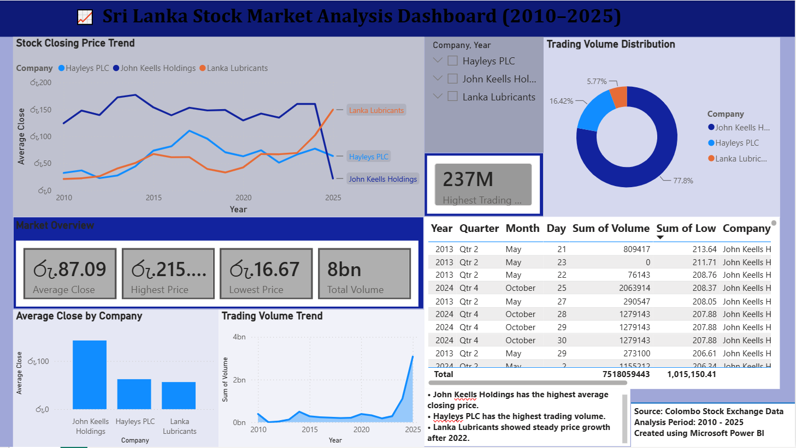

# Sri-Lanka-Stock-Market-PowerBI-Dashboard
Interactive Power BI dashboard for analyzing Sri Lanka stock market data (2010–2025).
# 📈 Sri Lanka Stock Market Analysis Dashboard (2010–2025)

An interactive Power BI dashboard built to analyze the performance of selected companies listed on the Colombo Stock Exchange (CSE).

## Dashboard Preview

> 

---

## Project Overview

This dashboard analyzes stock market data from 2010 to 2025 for:

- Hayleys PLC (HHL)
- John Keells Holdings (JKH)
- Lanka Lubricants (LLUB)

The dashboard enables users to:
- Monitor stock price trends
- Compare company performance
- Analyze trading volume
- Explore data using interactive filters

---

## Features

- 📊 KPI Cards
  - Average Closing Price
  - Highest Price
  - Lowest Price
  - Total Trading Volume
  - Highest Trading Volume

- 📈 Interactive Charts
  - Stock Closing Price Trend
  - Average Closing Price by Company
  - Trading Volume Distribution
  - Trading Volume Trend

- 🔎 Interactive Filters
  - Company
  - Year

- 📋 Detailed Stock Data Table

- 💡 Key Insights section

---

## Tools Used

- Microsoft Power BI
- Power Query
- DAX
- CSV Dataset

---

## Skills Demonstrated

- Data Cleaning
- Data Transformation
- Data Visualization
- Dashboard Design
- Business Intelligence
- DAX Measures
- Power Query

---

## Dataset

- Colombo Stock Exchange (CSE)
- Analysis Period: 2010–2025

---

## Author

**Dimasha Dissanayaka**
